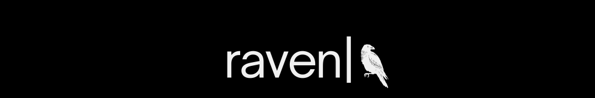

 

# Raven

**The causal memory layer for AI agents.**

Drop Raven into any agent — OpenClaw, LangGraph, Claude Desktop, or your own — and it gains persistent memory that survives across sessions, days, and weeks. Not flat retrieval. Causal structure. Every decision linked to what caused it, every parallel task tracked, every session resumable from exactly where you left off.

---

## Install into OpenClaw in 60 seconds

```bash
clawhub install raven-memory
```

That's it. Your OpenClaw agent now has persistent causal memory. Add to your system prompt:

```
At the start of every conversation, call raven_start_session.
Record significant events with raven_record_event.
End sessions with raven_end_session.
```

---

## Use with any MCP-compatible agent

Raven exposes itself as an MCP server. Any agent that supports MCP can use it:

```json
{
  "mcpServers": {
    "raven-memory": {
      "command": "python3",
      "args": ["-m", "tcc.integration.mcp_server"],
      "env": {
        "RAVEN_DB_PATH": "~/.raven/raven.db"
      }
    }
  }
}
```

Works with OpenClaw, Claude Desktop, Cursor, or any custom agent.

---

## Use with LangGraph directly

```python
from tcc.core.store import TCCStore
from tcc.core.dag import TaskDAG
from tcc.core.reconciler import SessionReconciler

store = TCCStore("raven.db")
dag = TaskDAG(store)
reconciler = SessionReconciler()

# Session start — injects chain context into agent
ctx = reconciler.start_session(dag, search_query="repulsor project")
print(ctx["summary"])  # inject this into your system prompt

# Record events during the session
reconciler.record_event(dag, ctx["session_id"],
    event="switched to titanium housing",
    actor="user",
    plan="carbon fiber failed stress test",
    context={}
)

# Session end
reconciler.end_session(dag, ctx["session_id"], notes="sim passed")
```

---

## The problem with AI memory today

Every AI assistant has the same flaw: it only knows what's in the current conversation. Close the chat, start a new one — blank slate. You spend the first five minutes re-explaining your project.

Existing memory systems (Mem0, Zep, Supermemory) fix this with RAG — they store facts and retrieve similar ones. But RAG can't answer:

- "Why did we switch materials?" ← requires tracing causes
- "What was happening while the sim was running?" ← requires parallel awareness
- "Roll back to before that decision" ← requires reversible history
- "What decision had the most downstream impact?" ← requires graph traversal

Raven answers all of these. Because Raven is a causal graph, not a retrieval index.

---

## How it works

Raven records everything as a **chain of causally-linked events**:

```
[started project]
      ↓
[ran aerodynamics sim]
      ↓
[decided to switch to titanium housing]
      ↓
[turned off lab lights] ←──┐  (ran in parallel)
[wrote CNC booking note] ←─┘
      ↓
[merged: both tasks done]
      ↓
[session ended]
```

Each node knows its parent. Parallel work branches and auto-merges. Wrong decision? Roll back. Session ended? Next session loads the chain and continues.

---

## Benchmark results

Raven was evaluated on **LoCoMo** — the standard long-term conversational memory benchmark used by Mem0, Zep, and OpenAI Memory.

| System | Overall | Temporal |
|---|---|---|
| OpenAI Memory | 52.9% | 21.7% |
| Zep | 66.0% | — |
| Mem0 | 67.1% | 58.1% |
| **Raven (standard)** | **TBD** | **TBD** |
| **Raven (adversarial)** | **TBD** | **TBD** |

*Adversarial conditions: 30% session crash rate, 3-node context window, 20% noise injection, cross-session references. Results pending — run the benchmark yourself.*

Raven also introduces **adversarial LoCoMo** — harder conditions that reflect real deployments. RAG systems degrade catastrophically under these conditions. Raven degrades gracefully because the causal chain survives crashes, noise, and long gaps.

---

## What the agent sees

At session start, the agent receives:

```
Last active: 3 days ago

Recent events:
  [user] decided to switch from carbon fiber to titanium housing (3 days ago)
    reason: carbon fiber too brittle under load testing
  [tool] run_simulation called (3 days ago)
    sim: repulsor_geometry_v4, result: drag coefficient 0.21
  [user] session ended (3 days ago)

Relevant historical context:
  [user] approved NordSpace proposal after stress sim passed
  [tool] CNC booking confirmed for tomorrow

Open threads: boot thrusters next, CNC time needs booking
Notes: titanium decision approved, moving forward
```

The agent reads this and continues. No re-explaining. No lost context.

---

## Tools exposed via MCP

| Tool | What it does |
|---|---|
| `raven_start_session` | Load chain context at conversation start |
| `raven_record_event` | Write an event to the causal chain |
| `raven_end_session` | Close session with notes |
| `raven_search` | Semantic search over full history |
| `raven_rollback` | Roll back N steps |
| `raven_get_status` | Health check and chain stats |

---

## Features

**Causal chain structure**
Every event knows what caused it. Trace any decision back to its origin. Understand exactly how a project reached its current state.

**Parallel work with automatic merging**
Run multiple tasks simultaneously. Raven tracks each branch and automatically merges when both complete. The agent sees a single coherent timeline.

**Multi-agent support**
Spawn specialized subagents — research, lab, home — each on its own branch. Raven merges results back to main automatically. Verified under concurrent load: 3 agents writing 15 nodes simultaneously, zero corruption.

**Semantic search over history**
sqlite-vec embeddings on every node. The agent's first message triggers semantic search over the full chain — relevant historical context surfaces automatically, not just recent nodes.

**Session continuity across crashes**
No clean session end? No problem. The chain records what was happening. Next session the agent reads the chain and knows where things stood.

**Rollback to any point**
Wrong decision? Roll back. History is preserved — the chain doesn't delete, it moves the tip pointer. Fully recoverable.

**OpenClaw compatible**
Full MCP server implementation. Install as a ClawHub skill. Marked `exclusive: true` — Raven replaces other memory skills cleanly, no conflicts.

**Local first, privacy first**
Everything in a single SQLite file on your machine. No cloud, no accounts, no data leaving your computer. Verified with Qwen3.5-4B via Ollama — full local stack.

**Model agnostic**
Works with any LLM. Swap models, upgrade, run locally or via API — the memory layer doesn't change.

**Encryption at rest** *(coming soon)*
AES-256 via SQLCipher. Keys in OS secure keychain. Optional high-security mode: execution state in RAM only, nothing written to disk except the encrypted chain.

---

## Example: three weeks later

**Without Raven:**
Blank slate. Ten minutes re-explaining context. Agent contradicts a decision it doesn't know you made.

**With Raven:**
```
Agent: Welcome back — it's been 3 weeks since we worked on Iron Man v2.

Last session you finished the right repulsor housing and approved
the titanium switch after the stress sim passed. Boot thrusters next.

CNC time needs to be booked before we can continue. Is that sorted?

You: Yeah, booked for tomorrow.

Agent: Perfect. Boot thruster sequence is next. You'll need the
plasma cutter and titanium stock. Want me to pull up the repulsor
geometry results as a reference?
```

30 seconds to full context. Zero re-explaining.

---

## Getting started

**As an OpenClaw skill:**
```bash
clawhub install raven-memory
```

**As a Python package:**
```bash
pip install -r requirements.txt
python3 test_full_system.py        # 15 core tests
python3 test_openclaw_integration.py  # MCP integration tests
```

**Run the LoCoMo benchmark:**
```bash
# Download dataset
wget https://raw.githubusercontent.com/snap-research/locomo/main/data/locomo10.json \
     -O benchmark/locomo10.json

# Run standard evaluation
python3 -m benchmark.run_benchmark --mode standard --max-examples 10

# Run adversarial evaluation
python3 -m benchmark.run_benchmark --mode adversarial --max-examples 10
```

---

## Test coverage

All tests verified on NVIDIA H100 with Qwen3.5-4B:

**Core (15 tests):**
DAG, persistence, rollback, parallel branching, auto-merge, session continuity, LangGraph interrupt/resume, multi-agent subagent spawn, concurrent write safety, conflict detection, sqlite-vec semantic search, semantic context injection

**MCP integration (9 tests):**
MCP handshake, tool listing, session start, event recording, status check, session end, persistence across restart, semantic search, rollback

---

## What's coming

**Speculative planning** — agent projects future steps as speculative nodes. Reality confirms or prunes them. Live hypothesis about what comes next.

**Payments** — virtual card via Marqeta, spending policy enforcement, Uber Eats / rides / tickets / shopping via ClawHub skills.

**Voice** — local wake word + Whisper + Piper TTS. Hands-free for lab work.

**Visual workspace** — Qwen3.5-4B native vision. Camera at session start. Agent sees the bench, knows what's assembled.

**ROS2 robotics** — connect any ROS2 hardware as a Raven tool. Existing ros-mcp-server compatible.

**RGAT** — graph attention network trained over the causal chain + semantic edges. Learns which past decisions predict current outcomes. Enables "what caused this" queries the chain alone can't answer.

**Hardware options:**

| Device | RAM | Model | Speed | Price |
|---|---|---|---|---|
| Any laptop | 8GB+ | Qwen3.5-4B | 10–25 tok/s | — |
| Beelink SER8 | 32GB | Qwen3.5-9B | 15–25 tok/s | ~$450 |
| Raspberry Pi 5 | 8GB | Qwen3.5-2B | 3–5 tok/s | ~$80 |
| Jetson Orin Nano | 8GB | Qwen3.5-4B | 15–25 tok/s | ~$250 |
| Jetson AGX Orin | 64GB | Qwen3.5-9B | 20–40 tok/s | ~$1000 |

---

## Project status

Core architecture complete and GPU-verified. MCP server complete and OpenClaw-compatible.

```
✅ Causal DAG (branch, merge, rollback)
✅ SQLite persistence
✅ Session reconciler
✅ Semantic search (sqlite-vec)
✅ Multi-agent with race condition safety
✅ MCP server (OpenClaw compatible)
✅ ClawHub skill manifest
✅ LoCoMo benchmark pipeline

In progress:
  → LoCoMo benchmark results
  → SQLCipher encryption
  → Speculative planning
  → RGAT
  → Payments (Marqeta)
  → ROS2 bridge
```

---

## Philosophy

Most AI memory systems try to solve the wrong problem. They make the AI remember the way a human remembers — continuously, in the background, always on. That's hard, expensive, and fragile.

Raven takes a simpler view: **the AI doesn't need to remember. It needs access to a reliable record of what happened.** The chain is that record. Always accurate. Always queryable. Always there.

Not a chatbot. Not a skill marketplace. Not a RAG system. A causal memory layer — infrastructure for agents that do real work, over real time.

Ravens remember. So does your agent.

---

*Drop in. Stay local. Never forget.*

---

## Future features

### DAG superpowers

**Chain diffing**
Compare two branches that approached the same problem differently. See exactly where decisions diverged, where they reconverged, and what the outcome difference was. Like `git diff` but for reasoning.

**Dead branch resurrection**
Abandoned an approach 3 months ago? New information makes it viable again. Find the abandoned branch tip, bring it forward as a new thread alongside main. The work was never lost — just parked.

**Counterfactual replay**
Fork a speculative branch from any past decision node — "what if we had done X instead" — run it forward, compare outcomes against main, then merge or prune. The original chain is untouched. Explore alternatives without committing.

**Causal blame assignment**
Something went wrong. Walk backwards from the failure node and weight each ancestor by downstream contribution. The root cause is structurally identifiable — the node with highest weighted contribution — with no ML required.

**Chain compression for cold storage**
Compress completed sub-chains between merge nodes into single summary nodes backed by archived detail. Agent reads summaries by default, drills into archives on demand. Like git squash but for memory.

**Confidence decay**
Nodes become less reliable over time. A decision from 6 months ago may be outdated. Every node carries a confidence score that decays as subsequent nodes touch the same domain. Agent flags stale nodes before acting on them.

**Cross-project node transplanting**
Solved a problem in project A? Transplant the relevant node subtree into project B as a reference branch. sqlite-vec identifies the pattern match. Agent says "we solved this before — want to use that approach?"

**Automatic milestone detection**
Identify natural completion points structurally — nodes where multiple branches converged and status confirmed. "Show me all milestones in this project" becomes a graph query, not a text search. No manual labeling required.

**Chain health metrics**
Structural properties computed at any point — depth (decisions deep), width (parallel branches open), merge frequency, rollback rate, speculative ratio. High rollback rate + wide branches + low merge frequency = project in trouble. Agent surfaces this proactively.

**Session templates from successful chains**
Completed a project successfully? Extract the chain as a reusable template — a proven sequence of decisions that worked. Agent recognizes similar projects via semantic match and asks "this looks like X project — use that workflow as a starting point?"

---

### RavenTemplates — workflow marketplace

Skills marketplaces sell tools. RavenTemplates sells proven workflows.

The difference: a skill is a hammer. A template is a blueprint for building a fireplace — the sequence of steps, the tools needed at each step, the decision points, the merge conditions, the known failure modes, and the successful outcome already encoded in the chain structure.

Templates are exported Raven chains — real causal sequences from completed projects, scrubbed of private data, packaged as reusable starting points.

**What a template looks like:**
```
Template: "Weld a fireplace surround"
  Steps: 14 nodes
  Tools: angle_grinder, mig_welder, measuring_tape
  Branch points: 2 (material choice, joint type)
  Known failure modes: 3 (encoded as rollback markers)
  Avg completion: 6 sessions
  Success rate: 94% (community verified)
```

**How it works:**
```
User: "I need to build a steel fireplace surround"
        ↓
Agent: searches RavenTemplates
        ↓
Finds "Weld a fireplace surround" template
        ↓
Imports chain skeleton into user's DAG as speculative nodes
        ↓
Agent works through the template, confirming nodes as steps complete
        ↓
Deviations from template create new branches
        ↓
User can contribute their completed chain back as an improved template
```

**Template categories:**
- Home fabrication (welding, woodworking, plumbing, electrical)
- Software projects (API integration, ML training runs, deployments)
- Research workflows (experiment sequences, literature reviews)
- Business processes (client onboarding, compliance audits)
- Creative projects (film production, game development, album recording)

---

### RGAT — graph attention over the causal chain

Richer relationships and searchable context over everything ever done. RGAT learns over two edge types:

- **Causal edges** — from the DAG (what caused what)
- **Semantic edges** — from sqlite-vec (what's similar to what)

Enables queries no retrieval system can answer: "what decision had the most downstream impact?", "which past session is most structurally similar to what we're doing now?", "what pattern of decisions tends to precede project failure?"

---

### More coming

- Encryption at rest (SQLCipher + OS keychain)
- Speculative planning (agent projects future nodes, reality confirms or prunes)
- Payments via Marqeta virtual card with spending policy enforcement
- Voice interface (Whisper + Piper TTS + wake word, hands-free for lab work)
- Visual workspace awareness (Qwen3.5 vision at session start, agent sees the bench)
- ROS2 bridge for robotics and home automation

Ravens remember. So does your agent.

---

*Drop in. Stay local. Never forget.*
